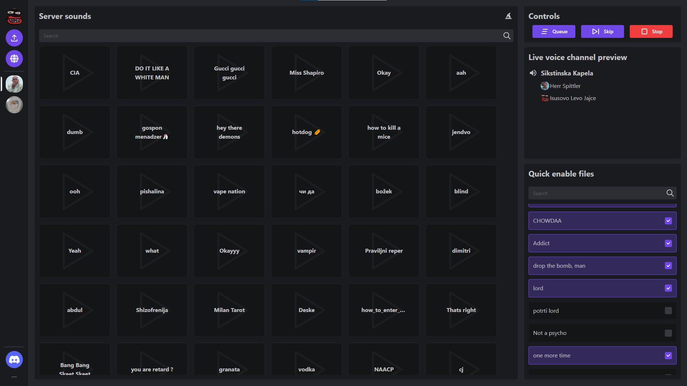

# Kekov Soundboard V2

**Website and Discord bot for playing sounds over Discord**


1. [Features](#features)
2. [Dev](#dev)
3. [Installation](#docker-installation)

## Features

- Beta version available at: [BETA](https://betabot.hrveklesarov.com/)
    - Upload is limited to select users only, other features are available
- Auth over Discords OAuth
- Sounds upload
- Multiple Discord server support
- Live Discord channels preview
- Public sound files
- Open [web api](backend_api/README.md)

## Dev

Project is separated into three parts:
1. [Backend and web api](backend_api)
2. [Discord bot](discord_bot) + [Lavalink](https://github.com/freyacodes/Lavalink)
3. [Website](website)



## Docker installation

**Prerequisites:**
- [docker](https://docs.docker.com/)
- [docker-compose](https://docs.docker.com/)

1. **Clone the repo**
```shell
git clone https://github.com/HrvojeLesar/kekov_soundboard_v2.git
```

2. **Create a .env file based on .env.example**
```shell
PG_PASSWORD=                    # Postgres (root) users password. Required by postgresql container.
DISCORD_CLIENT_ID=              # Client id of a discord application
DISCORD_CLIENT_SECRET=          # Client secret of a discord application (KEEP SAFE)
DISCORD_BOT_TOKEN=              # Token of a discord bot (application)
SOUNDFILE_DIR=/var/ksv2/sounds/ # Default directory for uploaded sound files (trailing slash is required)
WS_TOKEN=                       # Can be any value, user generated. Token for bot application to be able to connect to sync and controls websockets.
PG_USER=                        # Database user used to query database
PG_USER_PASSWORD=               # Database user password
PG_DB_NAME=                     # Database name
API_PORT=4833                   
```

3. **Build and run containers**

This builds and start docker 4 containers: database, api, bot and the website.
```shell
docker compose up -d --build
```
After starting containers website should be available on `localhost:5555` and the api on `localhost:5556`.

**Note:** Login uses OAuth2 thus an apropriate URI must be set in Discords application redirects. Example URI for development: `http://localhost:5555/login-callback`.
