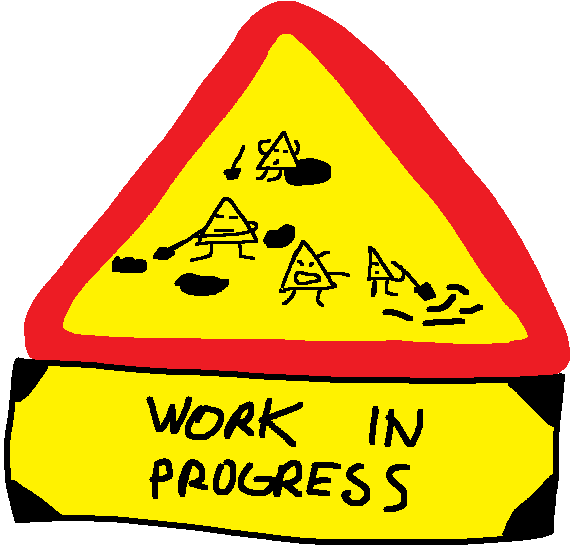

# Kekov Soundboard V2

**Website and Discord bot for playing sounds over Discord**

## Features

- Beta version available at: [BETA](https://betabot.hrveklesarov.com/)
    - Upload is limited to select users only, other features are available
- Auth over Discord OAuth
- Sounds upload
- Multiple Discord server support
- Live discord channels preview
- Public sound files
- Open [web api](backend_api/README.md)

## Dev

Project is separated into three parts:
1. [Backend and web api](backend_api)
2. [Discord bot](discord_bot) + [Lavalink](https://github.com/freyacodes/Lavalink)
3. [Website](website)
